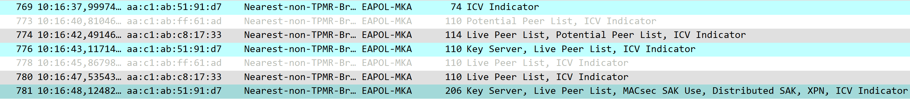

## Laboratory Experiments

Now that we have completed the laboratory setup, including its routers, hosts, and Linux bridges, we can begin the experimental section by seeing MKA and MACsec in action, testing their features, and learning about their inner workings.

## Deploy your laboratory

Let's begin by deploying our laboratory. Go to the ContainerLab page in VSCode, open the folder with your laboratory and select Deploy.

<figure markdown id="figure-4">
  {width="150"}
  <figcaption>Figure 4: Deploy Function</figcaption>
</figure>

When the deployment is finished, your laboratory and its devices should appear in the deployed section.

<figure markdown id="figure-5">
  {width="200"}
  <figcaption>Figure 5: Deployed Lab</figcaption>
</figure>

## Verify MKA, MACsec and IS-IS

Now that everything is running, access all four routers and ensure that MKA has active peers, that the MACsec CAs have been formed, and that the routing table displays the subnets learned from IS-IS.

To check the first two, you can run the following commands:

```srl
show macsec connectivity-association
show macsec mka-session
```

The first command will show the CAs present on that router, and the second will display all the peers running MKA with the selected router.

??? question "How many CAs does R1 have? What about the other routers? Is there a difference between them?"

    !!! solution "R1 has one CA, MACSEC_12, since it participates in only one association. R3 also participates in only one CA, MACSEC_23. The other two routers, R2 and R4, differ from the previous two because they participate in two associations at the same time, with both MACSEC_12 and MACSEC_23 shown in their tables."

After confirming that these checks are successful, we will check the routing table to ensure that we can communicate between the two hosts. To do that we use the command:

```srl
show router route-table
```

The result of this command should be a table with entries similar to those shown below:

<figure markdown id="figure-6">
  {width="500"}
  <figcaption>Figure 6: Route Table</figcaption>
</figure>

With all these elements in place and confirmed, we will now perform the final test to ensure the lab is ready for our experiments.

Now we will ping from host 1 to host 2. To do that, simply access host 1 through its shell and ping host 2 with the command:

```bash
ping 172.31.0.1
```

You should receive successful responses to your ping from host 2.

## MKA and MACsec packet analysis

In this section, we will take a more in-depth look at MKA and MACsec by triggering MKA to start again so that we can observe its handshake and the packets involved.

To achieve this, we will reboot both R2 and R4 and place Wireshark probes on their interfaces to observe the MKA packets traversing our laboratory.

To place the probes, use the available Capture function in VS Code and place a probe on both interfaces of both routers.

To reboot the routers, you can use the following command:

```srl
admin reboot now
```

This command should restart both routers, causing your connection to drop shortly afterward. You can then reconnect to the router and see that the Live Peer list is either empty or still forming.

This is where MKA comes in, rebuilding the CAs, reelecting a Key Server, and redistributing the SAKs to reestablish MACsec.

By filtering Wireshark for EAPOL packets, you will be able to see only MKA packets. With this filter, it will be easy to identify the normal MKA operation pattern once the connection has been established and is functioning. When the reboot is performed, we will be able to detect a major change in this pattern, allowing us to identify and study the packets sent during the handshake.

MKA normal operation should look like this:

<figure markdown id="figure-7">
  
  <figcaption>Figure 7: MKA Normal Operation</figcaption>
</figure>

In Figure 7, the first packet we see is from the Key Server, which announces itself and then sends information to keep the association alive. The other routers respond with their own information, completing the KeepAlive exchange.

When we disrupt this pattern by resetting the connection, we expect to see something similar to the following image:

<figure markdown id="figure-8">
  
  <figcaption>Figure 8: MKA Handshake</figcaption>
</figure>

The first five packets are unsuccessful attempts to find more peers and begin MKA. However, in the sixth packet, numbered 512, we see that both peer lists and basic parameters are sent, signaling that peers have been found and that the Key Server election has begun.

The following message comes from the elected Key Server, notifying its peers of its election, to which the other peers respond positively.

Finally, the Key Server distributes the SAK, which will be used by all peers to encrypt packets protected by MACsec.

!!! question "What is the cypher used for the key? What is this key identifier number? According to MACsec SAK Use were there any keys before this one?"

Now that MKA has been analyzed and its packets dissected, let's move on to viewing packets encrypted by MACsec and examining their contents.

To begin, keep your Wireshark probes active to capture the ICMP packets generated by our ping and encrypted by MACsec.

With the probes active, return to host 1 and begin a ping to host 2.

With the ping active, we will be able to see packets like the following pass through:

<figure markdown id="figure-9">
  
  <figcaption>Figure 9: MACsec Packets</figcaption>
</figure>

These packets contain the ICMP packets that make up the ping, although we cannot see them because they are encrypted by MACsec. Let's analyze the security tag and see if it matches what was shown in Figure 1.

<figure markdown id="figure-10">
  
  <figcaption>Figure 10: Live Security Tag</figcaption>
</figure>

As we can see, the security tag in our packet contains the TCI and AN at the beginning, followed by the SL, PN, SCI, and finally the ICV, matching what we saw in the theoretical introduction to this laboratory. The following data is protected by the SAK, so we cannot view it, as expected.

## Key Server Election and Reelection

In this experiment, our focus will be on the Key Server Election mechanism at the beginning of MKA and on the reelection of a Key Server when the current one is no longer available. We will also explore changing priorities to choose the Key Server.

The first step of this experiment is to analyze the router configurations and look for a specific line that changes the Key Server Election process.

In the configuration of R4, we can identify in the MACsec configuration the following line:

```srl
mka-key-server-priority 0
```

When a Key Server is being elected, if there is no configuration specifying the priority of these routers, MKA will use other factors, such as their member identifier. However, if all devices have their priorities explicitly configured, as in our laboratory, MKA elects the server with the highest priority, which is the device with a priority number closer to or equal to zero.

In our configurations, R4 has a priority of 0, which means it will always be elected if it is available. R2 has a priority of 1, while R1 and R3 have a priority of 10. These values were chosen with the intention of making the Key Server a device present in both CAs whenever possible.

We will now trigger an election process so that we can follow it in Wireshark and observe what happens.

To do so, set a probe in R1 and R3 facing their respective CAs.

To trigger a full election process rather than just a reelection, we will need to reboot all routers at the same time. To do so, use SSH to access all four routers and prepare the following command on each one to execute at the same time:

```srl
admin reboot now
```

By rebooting all nodes with Wireshark open, we will be able to watch the entire handshake process occur again, but this time we will focus only on the Key Server Election process.

After initiating the reboot, traffic in Wireshark will pause. When it resumes, the first few EAPOL packets will contain what we want to see. We will focus on the first few packets received in R1 and R3, where we can see them receiving a message from R4, with its priority, but still unelected.

<figure markdown id="figure-11">
  
  <figcaption>Figure 11: First packet from R4</figcaption>
</figure>

After this message, we can see the packet in which the Key Server announces its election, with the Key Server tag changing from False to True.

<figure markdown id="figure-12">
  
  <figcaption>Figure 12: Second packet from R4</figcaption>
</figure>

After this, MKA follows its regular process and enables MACsec to begin protecting traffic.

We will now observe a reelection in an already established CA by shutting down R4, causing R2 to become the new Key Server.

To do this, we will keep the previous Wireshark probes and run the following command on R4:

```srl
configure global
card 1 admin-state disable
commit
```

This command disables the router card, effectively preventing it from communicating with the remaining routers.

We can then observe that, after the last message from R4, a few KeepAlives will still arrive from R2 because the timer for R4 has not yet expired. After this, we will see a message from R2 announcing itself as the new Key Server and distributing the new SAK.

<figure markdown id="figure-13">
  
  <figcaption>Figure 13: Key Server Reelection</figcaption>
</figure>

After a brief wait for a KeepAlive, the members of the CA detect that R4 is no longer available, begin a reelection, elect R2 as the new Key Server according to our configured priorities, and resume normal operations without having to perform the entire handshake again.

## Key Rollover and Rekeying

We will now analyze another important feature of MACsec: its ability to change keys during operation, known as rollover, and the rekeying that occurs as a consequence.

To begin, we will change the MACsec configuration of CA12 in R1, R2 and R4, to have a second pre-shared key:

```srl
macsec {
        connectivity-association "MACSEC_12" {
            admin-state enable
            description "R1-R2-R4 MACsec"
            macsec-encrypt true
            clear-tag-mode none
            cipher-suite gcm-aes-xpn-128
            static-cak {
                active-psk 1
                mka-key-server-priority 10
                mka-hello-interval 5
                pre-shared-key 1 {
                    encryption-type aes-128-cmac
                    cak 0123456789ABCDEF0123456789ABCDEF
                    cak-name "CA12"
                }
                pre-shared-key 2 {
                    encryption-type aes-128-cmac
                    cak 123456789ABCDEF0123456789ABCDEF1
                    cak-name "CA21"
                }
            }
        }
    }
```

With the addition of a second key, we can now instruct the routers to switch their active pre-shared key to the new one during operation, starting a rollover process in CA12 that leads to the rekeying of the CA's keys.

Now save the new configurations and redeploy the laboratory for them to take effect. When the laboratory is redeployed, you can access any router with CA12 and verify that it is using PSK 1 with:

```srl
show macsec connectivity-association "MACSEC_12" detail
```

After confirming this, open two Wireshark probes on R1 and R2, facing CA12, and run the following command on all three routers:

```srl
configure global
macsec connectivity-association "MACSEC_12" static-cak active-psk 2
```

When you have done this in all three routers, run the following command at the same time:

```srl
commit
```

This will activate the change of the active pre-shared key, beginning a Key Rollover process in which the CA will begin rekeying its keys to use the new active PSK.

We can observe this process in Wireshark by noticing that the regular operation pattern is briefly affected and that a single packet is sufficient to process the rekeying:

<figure markdown id="figure-14">
  
  <figcaption>Figure 14: Key Rollover and Rekeying Part 1</figcaption>
</figure>

<figure markdown id="figure-15">
  
  <figcaption>Figure 15: Key Rollover and Rekeying Part 2</figcaption>
</figure>

In Figure 14, we can see that a single packet from the Key Server ordering the rekeying was sufficient to change the SAK used by the CA. We can also see in the packet details that the CAK name has changed from CA12 to CA21, which is the new key we added. We can also confirm that this is a new key by observing that the Latest Key, which is the new one, has not yet been transmitted or received.

Then, in Figure 15, we can see that the Key Number has been updated from 1 to 2.

And if we do the previous command:

```srl
show macsec connectivity-association "MACSEC_12" detail
```

We will see that the Active Pre-Shared-Key Index is now 2 and the CKN is CA21, proving that the rollover and rekeying have occurred successfully.

With this experiment, we added a new pre-shared key to CA12 and changed the active pre-shared key to the new one during operation. This initiated a Key Rollover process that led to a rekeying process coordinated by the Key Server, which generated new keys and resumed normal operation without having to reform the CA.

## Replay Attack and Protection

Another important feature of MACsec is its ability to prevent several types of attacks against its peers and communications. Some examples include denial-of-service attacks, intrusions, man-in-the-middle attacks, masquerading, and, most importantly for our experiment, replay attacks.

These attacks consist of capturing packets sent by a legitimate peer of a MACsec CA and replaying them in an attempt to obtain the keys used for encryption.

In our laboratory, the protection against this kind of attack is currently turned off, but we can easily turn it on by using the following configuration in all routers:

```srl
macsec {
        connectivity-association "MACSEC_12" {
            admin-state enable
            description "R1-R2-R4 MACsec"
            replay-protection true
            replay-window-size 32
            macsec-encrypt true
            clear-tag-mode none
            cipher-suite gcm-aes-xpn-128
            static-cak {
                active-psk 1
                mka-key-server-priority 10
                mka-hello-interval 5
                pre-shared-key 1 {
                    encryption-type aes-128-cmac
                    cak 0123456789ABCDEF0123456789ABCDEF
                    cak-name "CA12"
                }
                pre-shared-key 2 {
                    encryption-type aes-128-cmac
                    cak 123456789ABCDEF0123456789ABCDEF1
                    cak-name "CA21"
                }
            }
        }
    }
```

This configuration includes two new lines that activate replay protection and set the replay window to 32. This means that if a packet number differs from the current counter for that peer by more than 32, MACsec will drop the packet.

To confirm that the changes took effect, run the command:

```srl
show macsec connectivity-association "MACSEC_12" detail
```

Verify that replay protection is now enabled and that the replay window is 32.

Now that the protection is active, we must test it by performing an attack. To do this, we will perform a continuous ping from host1 to host2 and capture its packets as they cross the Linux bridge.

To perform this capture, first start a ping from host1 to host2, using the command:

```bash
ping 172.31.0.1
```

Then, on your main device terminal, run the command:

```bash
sudo tcpdump -i MACBridge1 -w macsec.pcap ether proto 0x88e5
```

This command will capture all MACsec traffic crossing MACBridge1, which will consist mostly of our ping packets.

With this large collection of packets, most, if not all, will be considered late by MACsec and dropped.

Now, run the command:

```bash
sudo tcpreplay -i MACBridge1 macsec.pcap
```

This command uses MACBridge1 to replay the captured packets to their respective receivers. After this is done, we expect to see statistics on the receivers showing late packets detected by MACsec, which will be dropped according to the replay protection we activated.

To see these statistics we go to R1 and use the command:

```srl
show port 1/1/c2/1 macsec sub-port 1 statistics
```

This will show statistics for different parts of MACsec. The statistics we are interested in are shown below:

<figure markdown id="figure-16">
  {width="500"}
  <figcaption>Figure 16: Replay Attack Statistics in R1</figcaption>
</figure>

In R1, we can see that MACsec identified 24 packets as late, meaning that they were outside the replay protection window and were therefore discarded. We can observe this same behavior in R2:

<figure markdown id="figure-17">
  {width="500"}
  <figcaption>Figure 17: Replay Attack Statistics in R2</figcaption>
</figure>

We can observe that in this case, MACsec detected 31 late packets and discarded them.

With this experiment, we activated MACsec's replay protection, learned about its functionality and features, such as the replay protection window, and performed a simple replay attack against the routers in CA12. This confirmed that MACsec detected the late packets we sent and promptly discarded them.

We hope that these experiments helped you understand MACsec and provided you with the necessary tools to configure and use it in real-world scenarios. We hope you enjoyed this laboratory, and we look forward to seeing you in the ANYsec laboratory!
